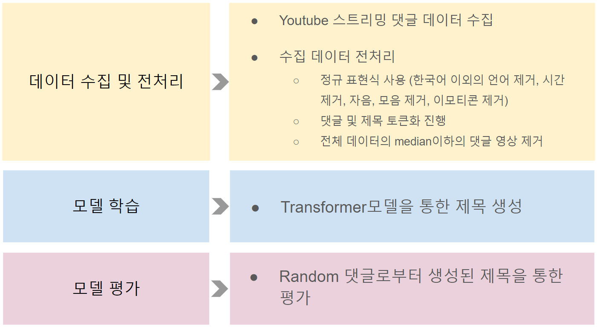
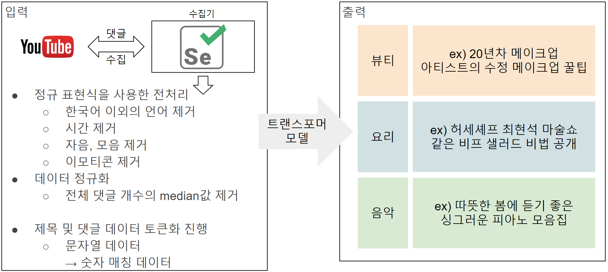

# TermProject
고급인공지능 텀프로젝트(김수현, 황동준)

## 자연어 문제
- Transformer모델을 사용한 스트리밍 영상(Youtube등)의 댓글 분석을 통한 제목 생성

## 풀고자 하는 문제
- 사용자가 스트리밍 서비스를 이용할 경우 썸네일과 제목이 일치하지 않는 경우가 있어 해당 영상이 어떠한 내용인지 알기 힘들 수 있음
- 개성적인 제목이 보다 높은 조회수를 발생시키는 것을 알 수 있음

## 해결방법에 대한 아이디어
- 기사를 보고 제목을 유추하는 방법을 착안하여 Youtube 영상 댓글을 요약하는 방식으로 제목 생성이 가능하다 생각

## 전체 시스템 구조

## 데이터 입력 / 출력 시나리오

## 수집한 데이터 셋
카테고리 | 댓글 개수 | 영상 수
------|------|------
요리 | 16,412개 | 70개
뷰티 | 19,179개 | 60개
음악 | 10.757개 | 63개
계 | 46,348개 | 193개

## 구현방법
<ol>
  <li> 데이터 수집 </li>
  <ul>
   <li> python의 Selenium 모듈을 사용하여 Youtube 댓글 수집기 제작 </li>
  </ul>
  <li> 데이터 분석</li>
  <ul>
   <li> 수집한 데이터 전처리 : 한글 이외의 언어, 시간, 이모티콘 제거 </li>
   <li> 정규화 작업 : 전체 댓글 개수의 중앙값 이하일 경우 제거 </li>
  </ul>
  <li> 학습 모델 제작</li>
  <ul>
   <li> Tensorflow에서 제공하는 Transformer 모델을 사용하여 학습 진행 </li>
  </ul>
  <li> 학습 예측</li>
  <ul>
   <li> 댓글을 랜덤으로 선정하여 학습 모델이 생성한 제목을 통해 평가 진행 </li>
  </ul>
</ol>
